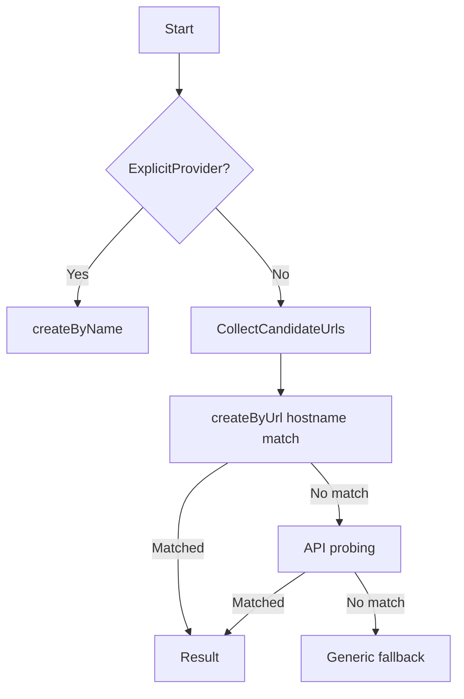

 # Git Platform Detector

[](https://github.com/LiquidLogicLabs/npm-package-git-platform-detector/actions/workflows/ci.yml)
[](https://www.npmjs.com/package/@liquidlogiclabs/git-platform-detector)
[](https://opensource.org/licenses/MIT)
[](https://www.typescriptlang.org/)

Lightweight platform detection for Git hosting providers. Designed for GitHub Actions and self-hosted Gitea, with easy extensibility for additional platforms.

## Features

- Hostname matching followed by API probing for unknown hosts
- Explicit provider override when required
- Clean provider factory with validation and credentials support
- Simple extension model for new platforms
- Node.js 20 compatible

## Detection flow



## Installation

```bash
npm install @liquidlogiclabs/git-platform-detector
```

The package is published publicly to npmjs and installs with no authentication.

## Basic usage

```ts
import { detectPlatform } from '@liquidlogiclabs/git-platform-detector';

const result = await detectPlatform({
  repositoryUrl: 'https://gitea.example.com/org/repo',
  credentials: { token: process.env.GITEA_TOKEN }
});

console.log(result.providerId);
console.log(result.baseUrl);
```

## Explicit provider

```ts
import { detectPlatform } from '@liquidlogiclabs/git-platform-detector';

const result = await detectPlatform({
  requestedProvider: 'gitea',
  repositoryUrl: 'https://gitea.example.com/org/repo'
});
```

## Factory usage

```ts
import { createByName, createByUrl } from '@liquidlogiclabs/git-platform-detector';

const explicit = createByName('github');

const auto = await createByUrl('https://github.com/octo/repo', {
  credentials: { token: process.env.GITHUB_TOKEN }
});
```

## API reference

### `detectPlatform(options)`

Returns a `DetectionResult`:

- `providerId`: detected provider id
- `baseUrl`: normalized base URL (if available)
- `owner`, `repo`: parsed owner/repo (when available)
- `confidence`: numeric confidence score
- `evidence`: detection evidence list

### `createByName(name, options)`

Validates and returns a provider by name. No hostname matching or probing is performed.

**Provider Aliases**: The following aliases are supported for the generic provider:
- `generic` (canonical name)
- `git` (alias for generic - local Git CLI operations)
- `local` (alias for generic - local Git CLI operations)

All aliases are case-insensitive and map to the `generic` provider.

### `createByUrl(url, options)`

Runs hostname matching first, then API probing. Returns a provider match or falls back to generic.

### `collectCandidateUrls(options)`

Collects URLs from explicit inputs and environment variables.

### `getBuiltInProviders()`

Returns every built-in `Provider` — GitHub, Gitea, Bitbucket and the generic
fallback. Useful for inspecting what will be matched against, or for building a
custom provider list.

```ts
import { getBuiltInProviders } from '@liquidlogiclabs/git-platform-detector';

console.log(getBuiltInProviders().map(p => p.id));
// ['gitea', 'github', 'bitbucket', 'generic']
```

### `getProviderById(id, providers?)`

Looks up a single provider by id, returning `undefined` if there is no match.
Pass `providers` to search a custom list instead of the built-ins.

## URL helpers

### `toUrl(input)`

Parses a string into a `URL`, returning `undefined` rather than throwing when the
input is not a valid URL. Use it when handling untrusted or optional input.

### `parseOwnerRepo(url)`

Extracts `{ owner?, repo? }` from a repository URL. Both fields are optional —
a URL that does not contain them yields an empty object rather than an error.

```ts
import { toUrl, parseOwnerRepo } from '@liquidlogiclabs/git-platform-detector';

const url = toUrl('https://github.com/octocat/Hello-World.git');
if (url) console.log(parseOwnerRepo(url)); // { owner: 'octocat', repo: 'Hello-World' }
```

### `isGiteaActionsEnvironment(env?)`

Returns `true` when the current environment looks like Gitea Actions rather than
GitHub Actions. Defaults to `process.env`; pass an object to test explicitly.

Detection is by environment shape, not by hostname — a `GITHUB_SERVER_URL` that
does not point at github.com indicates Gitea running in GitHub-compatibility
mode.

## Logging

The library never logs credentials. Supply a `Logger` to see detection steps:

```ts
import { detectPlatform, ConsoleLogger } from '@liquidlogiclabs/git-platform-detector';

await detectPlatform({
  repositoryUrl: 'https://gitea.example.com/org/repo',
  logger: new ConsoleLogger()
});
```

`ConsoleLogger` writes to the console; `NoopLogger` discards everything and is
the default. A `Logger` is any object with `info`, `warn` and `debug` methods
taking a single string, so your own logger can be passed directly.

## TypeScript

Types ship with the package. In addition to the functions above, these types are
exported for annotating your own code:

`BuiltInProviderId`, `ProviderId`, `CredentialSet`, `ProbeContext`,
`ProbeResult`, `DetectionEvidence`, `DetectionResult`, `Logger`, `Provider`,
`FactoryOptions`.

## Supported providers

- GitHub
- Gitea
- Bitbucket
- Generic (fallback)

## Extending with a new provider

1. Implement the `Provider` interface in `src/providers/<provider>.ts`.
2. Register the provider in `src/providers/index.ts`.
3. Add unit tests for hostname matching and probe behavior.

Example provider structure:

```ts
import type { Provider } from '@liquidlogiclabs/git-platform-detector';

export const myProvider: Provider = {
  id: 'my-platform',
  displayName: 'My Platform',
  isUrlMatch: (url) => url.hostname.endsWith('example.com'),
  probeApi: async () => ({ matched: false }),
  determineBaseUrl: (urls) => urls[0]
};
```

## Security

- Tokens can be passed via `credentials` for API probing.
- Use environment variables or secrets for tokens in CI.
- Avoid logging tokens; the library never logs credentials.

## Requirements

Node.js 20 or later (`engines: node >=20`). Ships CommonJS with TypeScript
declarations.

## Contributing

Source lives at
[LiquidLogicLabs/npm-package-git-platform-detector](https://github.com/LiquidLogicLabs/npm-package-git-platform-detector).
Issues and pull requests are welcome there.

```bash
npm install
npm run build
npm test
```

## License

MIT

